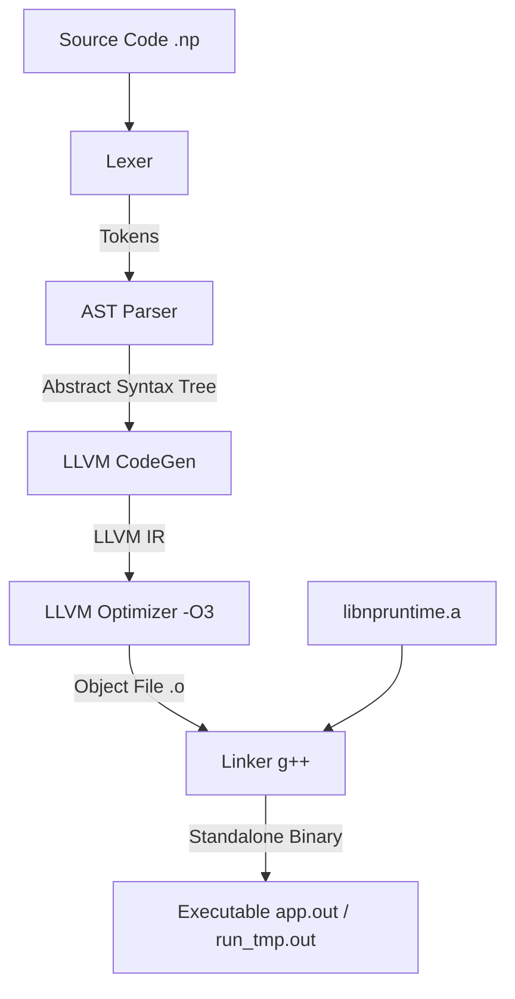

# NP Compiler & Language Reference

Welcome to the **NP Compiler** project! NP is a lightweight scripting language designed to combine Python-style clean syntax (indentation-based blocks, comprehensions, and structures) with native C++ execution speeds and automated Garbage Collection.

---

## Language Documentation

To understand the language features in detail, check out the following sub-documents:
*   **[Getting Started Guide](docs/getting_started.md):** Installation, host setup, run/build commands, and Docker execution.
*   **[Language Specification](docs/language_specification.md):** Core syntax, variables, scopes, type rules, conditionals, loops, functions, and slicing.
*   **[Advanced Features Guide](docs/advanced_features.md):** Structs, import modules, Pythonic list/dict comprehensions, 128/256-bit signed integers, and try/except exceptions.
*   **[Standard Library Reference](docs/standard_library.md):** Built-in utility functions, File I/O helpers, and methods for strings and arrays.
*   **[Package & Dependency Manager](docs/package_manager.md):** Managing remote libraries, `np.req` requirements, and `np.req.log` integrity checksums.
*   **[NP Programming Tutorial Book](docs/tutorial/README.md):** A step-by-step programming book covering NP basics to advanced topics.

---

## Compilation Pipeline (LLVM Backend)

NP compiles `.np` source files directly to native machine-code binaries using the LLVM C++ API and a precompiled C-compatible runtime library (`runtime/libnpruntime.a`).



### Compilation Flow
1. **Lexical Analysis (`core/lexer.cpp`)**: Scans source files into discrete tokens.
2. **AST Parsing (`core/parser.cpp`)**: Parses tokens into an Abstract Syntax Tree (AST) representing the program structure.
3. **LLVM CodeGen (`core/llvm_codegen.cpp`)**: Traverses the AST to generate LLVM Intermediate Representation (IR), optimizing it at the IR level (equivalent to `-O3`).
4. **Target Emission**: Emits a native machine-code object file (`temp.o`).
5. **Linking**: Links the object file with `runtime/libnpruntime.a` using `g++` to produce a standalone executable binary.

---

## Quick Start with Docker

You can compile and run NP code instantly via Docker. Mount your current directory (`$PWD`) to the container's `/workspace`:

### Linux / macOS (Bash/Zsh):
```bash
alias np='docker run --rm -it -v "$PWD":/workspace pib21/np-lang:alpine-3.22'

# Run immediately (interpreting style)
np tests/advanced_features_test.np

# Compile to a binary (AOT)
np build tests/advanced_features_test.np
```

---

## Core Mechanisms & Features

### 1. AST-based Parser & LLVM CodeGen Backend
NP uses a hand-written recursive descent parser to build an Abstract Syntax Tree (AST), which is then processed by an LLVM backend to generate highly optimized machine code directly. This yields near-instant compilation and true native execution performance.

### 2. Automatic Memory Management (Reference Counting / RAII)
*   **Stack Allocation:** Primitive types (`int`, `float`, `bool`, `string`) are mapped to C++ primitives and stack-allocated, leaving no footprint.
*   **Reference Counting:** Complex data structures (`array`, `dict`) are heap-allocated and managed automatically using standard C++ reference-counting smart pointers (`std::shared_ptr`). They are reclaimed instantly and deterministically as soon as they are no longer referenced, with no garbage collector overhead.

### 3. Built-in 128-bit & 256-bit Integers
*   `int128` maps directly to GCC's native `__int128` type.
*   `int256` is a software-implemented 256-bit signed integer supporting math, comparisons, division, and modulo natively in the compiler.
