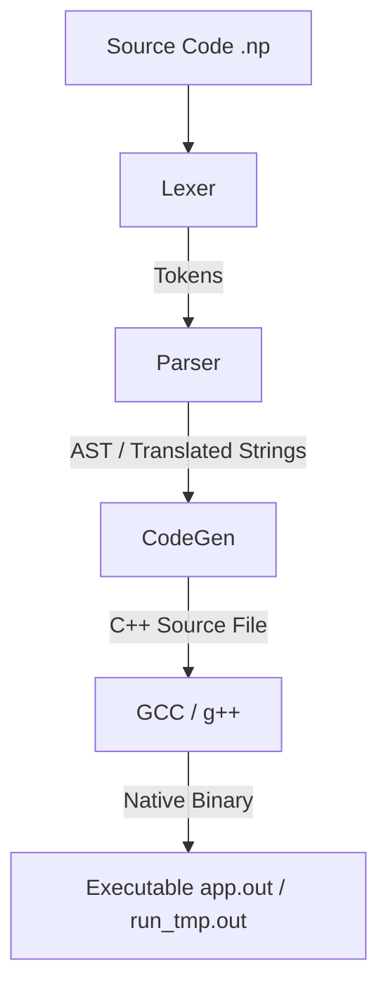

# NP Compiler Architecture & Language Structure

This document outlines the compiler design, compilation pipeline, runtime type system, memory management, and code structure of the NP programming language. It is designed to help developers understand the codebase and continue extending the language.

---

## 1. High-Level Architecture

NP is an **Ahead-of-Time (AOT) Transpiler** (Source-to-Source Compiler) that compiles Python-like `.np` code into highly optimized standard C++17, which is then compiled into a native machine-code binary by GCC (`g++`).

The compiler is written in C++17 and consists of three core stages:



### Core Components
*   **Lexer (`core/lexer.cpp`, `include/lexer.hpp`)**: Scans source files and splits characters into discrete `Token` structures.
*   **Parser (`core/parser.cpp`, `include/parser.hpp`)**: A single-pass, stateful recursive descent parser. It translates grammar rules directly into C++ target statements and builds namespaces/types on the fly.
*   **CodeGen (`core/codegen.cpp`, `include/codegen.hpp`)**: Emits the final C++ source code, bundling standard headers, the `np_var` runtime, operators, standard libraries, and the parsed program logic.
*   **Driver (`main.cpp`)**: Orchestrates the translation pipeline and invokes GCC.

---

## 2. Compilation Flow & Execution Modes

The driver (`main.cpp`) supports two execution modes:

### A. Run Mode (`./np <file.np> [args]`)
Used for quick prototyping (similar to python).
1. The compiler parses `<file.np>` and writes the output C++ code to a temporary file `run_tmp.cpp`.
2. Invokes GCC to compile it: `g++ -std=c++17 -O3 run_tmp.cpp -o run_tmp.out`.
3. Runs the temporary binary and forwards all trailing arguments: `./run_tmp.out [args]`.
4. Deletes both temporary files (`run_tmp.cpp` and `run_tmp.out`) immediately after execution.

### B. Build Mode (`./np build <file.np>`)
Used for production (similar to go).
1. Parses `<file.np>` and generates `output_tmp.cpp`.
2. Compiles it using GCC with optimization: `g++ -std=c++17 -O3 output_tmp.cpp -o app.out`.
3. Cleans up `output_tmp.cpp`, leaving a standalone optimized machine-code binary `app.out`.

---

## 3. Lexical Analysis (The Lexer)

The lexer reads the source string and generates a flat `std::vector<Token>`. 
NP syntax is indentation-sensitive. The lexer uses a stack of indentation levels to track scopes:
*   Comparing spaces at the start of lines to the stack top.
*   Emitting `TokenType::INDENT` when indentation increases.
*   Emitting one or more `TokenType::DEDENT` when indentation decreases.
*   Emitting `TokenType::NEWLINE` at logical line endings.

Keywords such as `fn`, `struct`, `if`, `while`, `try`, `throw`, and primitive data types are scanned and tokenized into distinct token types.

---

## 4. Syntax Analysis & Transpilation (The Parser)

The parser reads tokens sequentially and performs single-pass translation:
*   **Type Tracker (`variables`)**: Maps variable names to their compiled types (e.g. `int`, `float`, `string`, `np_var`).
*   **Structure Tracker (`structs`)**: Maps struct names to a list of their field name-type pairs.
*   **Import Resolution (`imported_modules` / `imported_files`)**: Tracks which modules (e.g., `sys`, `json`) and files are loaded. Circular import guards prevent duplicate compilation.
*   **Transpiler Translations**:
    *   `print(...)` -> `np_print(...)`
    *   `len(...)` -> `np_len(...)`
    *   `type(...)` -> `np_type(...)`
    *   `input(...)` -> `np_input(...)`
    *   `sys.argv` -> `np_sys_argv`
    *   `time.sleep(x)` -> `np_time_sleep(x)`
    *   `json.parse(x)` -> `np_json_parse(x)`
    *   `regex.match(p, t)` -> `np_regex_match(p, t)`
    *   `try:` / `except Exception e:` / `throw x` -> standard C++ `try` / `catch` / `throw` constructs.
    *   `[x * 2 for x in range(1, 5)]` -> Immediately Invoked C++ Lambda Expressions (IIFE).
    *   `struct User` declarations -> Backed by dictionary instances, with constructor calls transpiled to initialization maps: `np_var(std::map<std::string, np_var>{...})`.
    *   Dot-access (`object.field`) -> Index-access `object["field"]`, except for built-in list/string methods (e.g. `.sort()`, `.split()`) which transpile directly to C++ method calls.

---

## 5. Runtime & The Type System (`np_var`)

The core of NP's dynamic capabilities is the `np_var` struct, defined inside the generated C++ code by `core/codegen.cpp`.

```cpp
struct np_var {
    std::variant<
        int64_t,
        double,
        np_string,
        bool,
        std::shared_ptr<np_var_list>,
        std::shared_ptr<np_var_dict>,
        np_int128,
        np_int256
    > v;
    ...
};
```

### Type Conversions
`np_var` implements implicit conversion operators (e.g. `operator int64_t() const`, `operator np_string() const`) and overloads helper operators (`+`, `-`, `*`, `/`, `%`, `^`, and comparisons) to handle mixed runtime operations gracefully.

### Collections Runtime
*   **`array`** maps to `std::shared_ptr<np_var_list>`, wrapping a `std::vector<np_var>`.
*   **`dict`** maps to `std::shared_ptr<np_var_dict>`, wrapping a `std::map<std::string, np_var>`.
*   Methods like `arr.sort()`, `arr.reverse()`, `arr.contains()`, `string.split()`, `string.join()`, and `string.trim()` are defined in C++ helper overloads.

---

## 6. Memory Management (Reference Counting)

NP does **NOT** use a Garbage Collector. Instead, it utilizes C++ RAII (Resource Acquisition Is Initialization) and automatic reference counting:

*   Dynamic variables (`array` and `dict`) are allocated on the C++ heap wrapped inside `std::shared_ptr`.
*   Copying or passing these structures increments the reference counter automatically.
*   When all variables referencing a structure go out of scope or are reassigned, C++ decrements the reference count.
*   Once the count reaches **0**, C++ automatically destroys the wrapper (`np_var_list` / `np_var_dict`), calling the destructors of the underlying `std::vector` and `std::map` to cleanly release all memory back to the OS.
*   This removes runtime garbage collection pauses and completely eliminates external library dependencies (no `libgc` required).

---

## 7. Developer Guide: How to Extend NP

If you want to add new features to the NP language:

### A. To Add a New Keyword or Token Type:
1.  Open `include/common.hpp` and add a new type enum to `TokenType`.
2.  Open `core/lexer.cpp`, locate the keyword scanning block (inside `Lexer::tokenize()`), and map the string representation to the new `TokenType`.

### B. To Add a New Statement or Expression Rule:
1.  Open `core/parser.cpp`.
2.  For expressions, add rule mappings inside `Parser::parseExpressionUntil()`.
3.  For statements, add rule mappings inside `Parser::parseStatement()`.

### C. To Add a Runtime Function or Module:
1.  Open `core/codegen.cpp`.
2.  Locate `CodeGen::generateCPlusPlus()`.
3.  Add the standard C++ implementation string to the `out` stream so it is compiled into all target binaries.
4.  Open `core/parser.cpp` and map the NP-side function name to the C++ runtime name.
